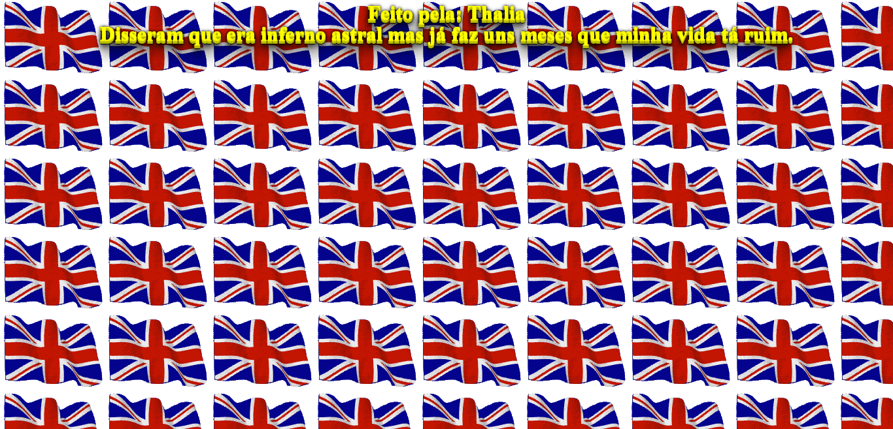

# 🎲 Site Aleatório 🎲

## Um modelo de site feito em React unpkg usando gifs aleatórios. Inspirado no site cachemonet.com

## Ajude-nos, a melhorar o site 🤩❤️

    FEITO POR https://github.com/LucasATS
    INSPIRADO EM https://cachemonet.com/ (A maioria das imagens, gifs e o audio foram extraídas desse site)
    Os textos foram extraídos desse site https://www.42frases.com.br/frases-curtas-e-engracadas/

[ACESSAR SITE](https://lucasats.github.io/SiteAleatorio/)

## __🎯 METAS__
- [ ] Criar um sistema de compartilhamento
  Irá tirar um shotscreen da tela, com o link da pagina do site, podendo ser compartilhada nas redes sociais.
- [ ] Sistema para trocar as gifs randomicamente de forma automatica sem interroper o sistema manual.
- [x] Adicionar SEO na página.
- [x] Sistema de troca de gifs.
- [x] Sistema de troca de textos.

## __❤ AGRADECIMENTOS__
[Daniel Olivet](https://github.com/daniolivet)
"I have added new gifs to your pool and refactoring index.js code, I hope it comes in handing :)"

## __🛠 TECNOLOGIA__

## __😘 CONTATO__

  
  
  
   

